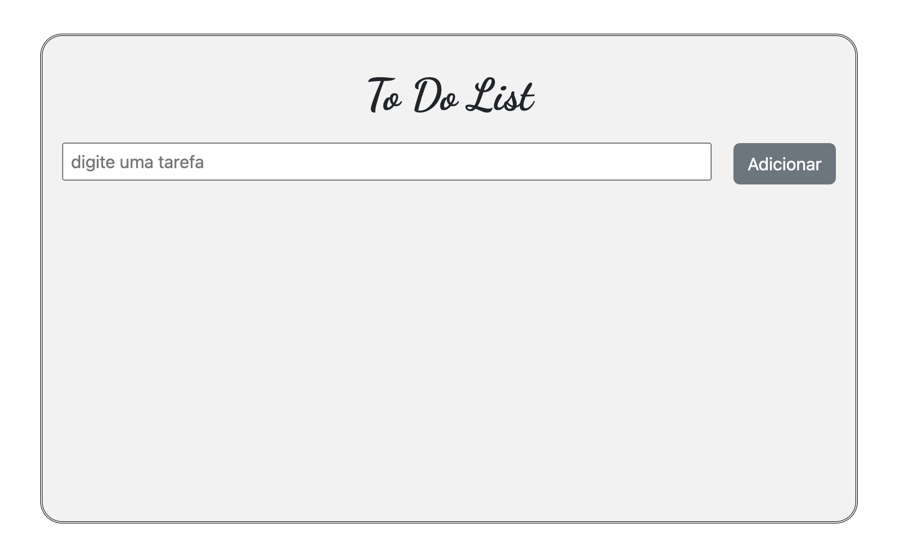
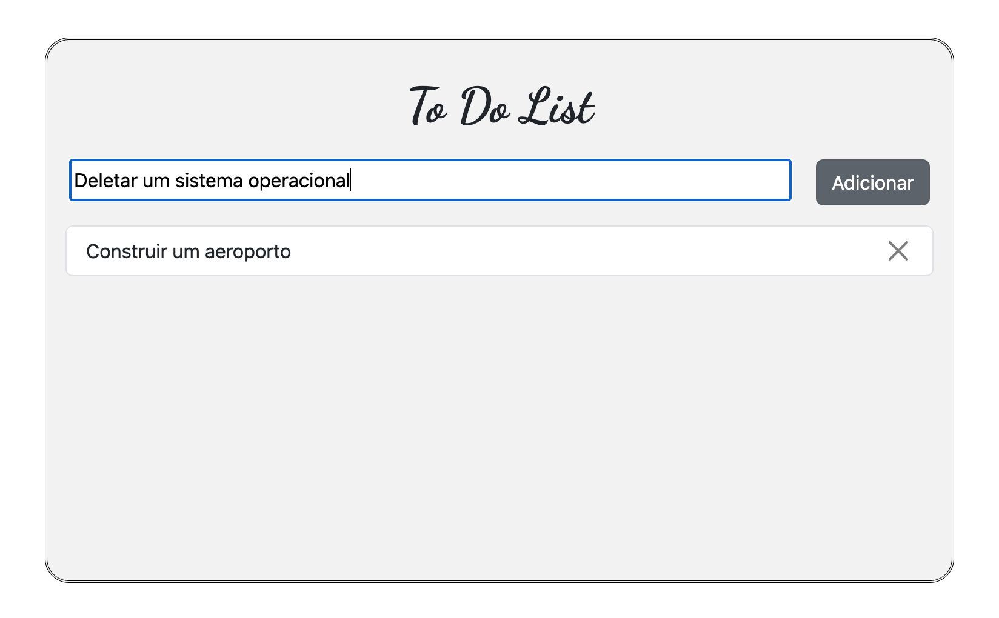

# To do list

## Table of contents

- [Overview](#overview)
  - [The challenge](#the-challenge)
  - [Screenshots](#screenshots)
  - [Links](#links)
- [My process](#my-process)
  - [Built with](#built-with)
  - [What I learned](#what-i-learned)
  - [Continued development](#continued-development)
  - [Useful resources](#useful-resources)
- [Author](#author)

## Overview

### The challenge

First App with Angular

Users should be able to:

- Type a task in the input;
- Add the task to the page by pressing the add button
- delete the task by pressing the close button
- use the page in different devices and screen sizes

### Screenshots





### Links

- Solution URL: [GithHub Repository](https://github.com/danielrsouza10/to-do-list-angular)
- Deploy URL: [To do List](https://to-do-list-angular-six.vercel.app/)

## My process

### Built with

- Angular CLI
- Semantic HTML5 markup
- CSS custom properties
- Flexbox
- TypeScript

### What I learned

How to create Angular Apps.
How to store the value of the input in variables declared in the ts component.
Show new items in the page with TypeScript

```typescript
import { Component } from '@angular/core';

@Component({
  selector: 'app-to-do-list',
  templateUrl: './to-do-list.component.html',
  styleUrls: ['./to-do-list.component.css'],
})
export class ToDoListComponent {
  title: string = 'To Do List';
  task: string = '';

  onClickButton() {
    if (this.task === '') {
      alert('digite uma tarefa');
    } else {
      const container = document.querySelector('.list-group');
      const item = document.createElement('li');
      const closeButton = document.createElement('button');
      item.innerText = this.task;
      this.task = '';
      item.className =
        'list-group-item d-flex justify-content-between align-items-center';
      closeButton.className = 'btn-close';
      closeButton.value = 'X';
      closeButton.addEventListener('click', () => {
        container?.removeChild(item);
      });
      item.appendChild(closeButton);
      container?.appendChild(item);
    }
  }

}

````html
<div class="to-do">
  <h1>{{ title }}</h1>
  <input
    type="text"
    placeholder=" digite uma tarefa"
    [(ngModel)]="task"
    (keydown.Enter)="onClickButton()"
  />
  
    <button type="button" class="btn btn-secondary" (click)="onClickButton()">
      Adicionar
    </button>
 

  <ul class="list-group"></ul>
</div>

````

### Continued development

Select bigger projects to improve the skills with the framework.


## Author

- Website - [Linkedin](https://www.linkedin.com/in/danielrsouza/)
- Instagram - [@danielrsouza](https://www.instagram.com/danielrsouza)
